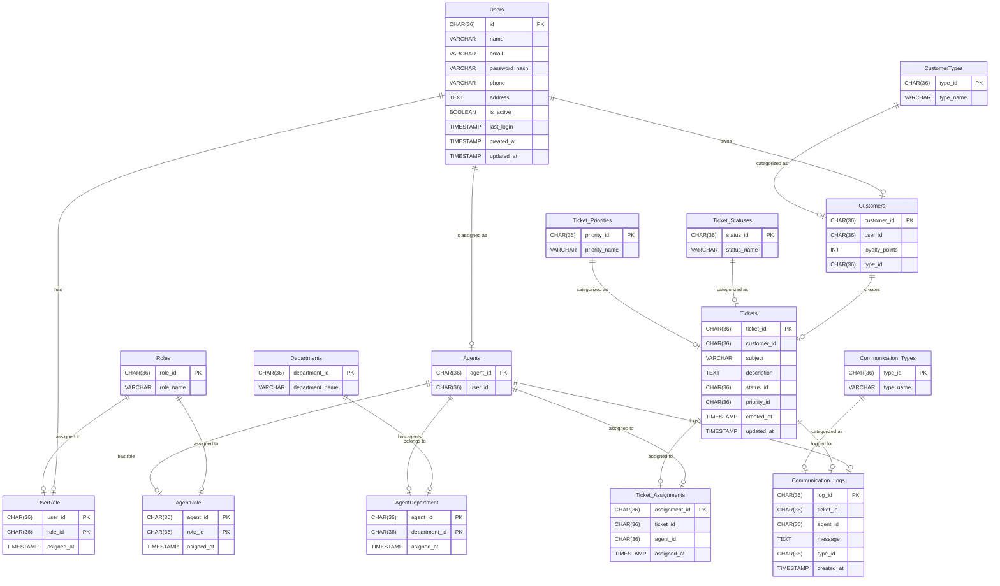
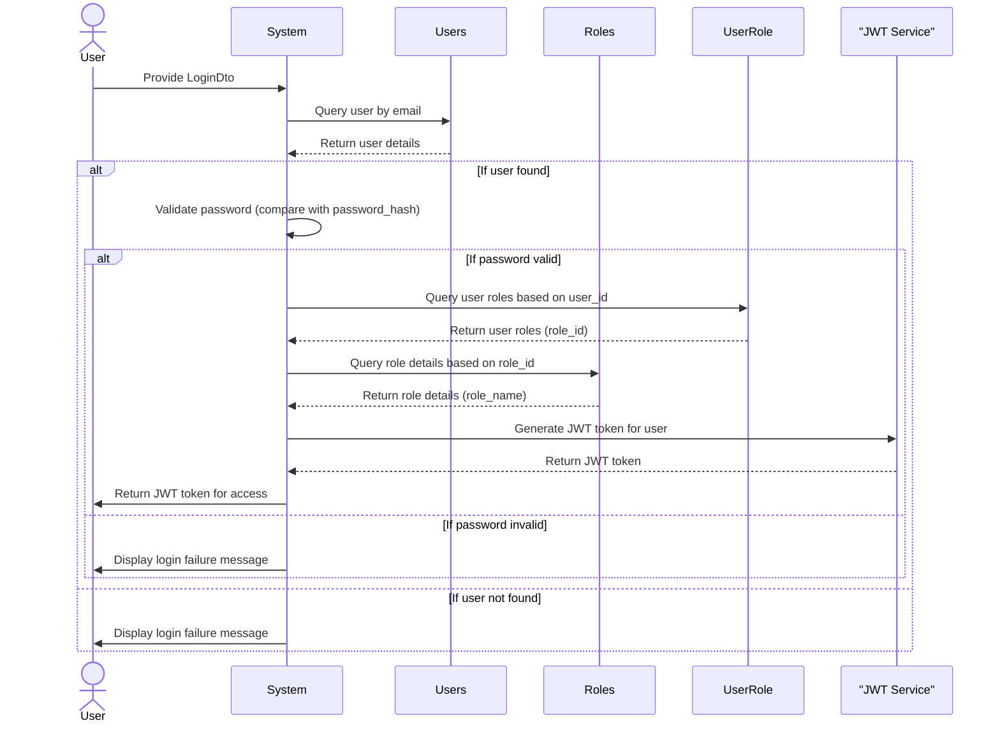

# Project Task List

## Task Table

| **ID** | **Task Description**                      | **Category**         | **Estimated Time (days)** | **Actual Time (days)** | **Delay (days)** | **Notes** |
| ------ | ----------------------------------------- | -------------------- | ------------------------- | ---------------------- | ---------------- | --------- |
| 1      | Design database schema in 3NF             | Database Design      | 5                         |           4             |         0         |           |
| 2      | Write database migrations                 | Database Design      | 3                         |           1             |         0         |           |
| 3      | Create user management microservice       | Backend Development  | 5                         |                        |                  |           |
| 4      | Create customer service microservice      | Backend Development  | 7                         |                        |                  |           |
| 5      | Create agent service microservice         | Backend Development  | 7                         |                        |                  |           |
| 6      | Create ticket management service          | Backend Development  | 7                         |                        |                  |           |
| 7      | Create communication service microservice | Backend Development  | 6                         |                        |                  |           |
| 8      | Implement JWT authentication              | Backend Development  | 4                         |                        |                  |           |
| 9      | Set up API Gateway                        | Backend Development  | 3                         |                        |                  |           |
| 10     | Create login and registration UI          | Frontend Development | 4                         |                        |                  |           |
| 11     | Implement customer ticket management UI   | Frontend Development | 6                         |                        |                  |           |
| 12     | Implement agent ticket management UI      | Frontend Development | 6                         |                        |                  |           |
| 13     | Add role-based access control in UI       | Frontend Development | 3                         |                        |                  |           |
| 14     | Write unit tests for backend services     | Testing              | 5                         |                        |                  |           |
| 15     | Write unit tests for frontend components  | Testing              | 5                         |                        |                  |           |
| 16     | Perform end-to-end testing                | Testing              | 5                         |                        |                  |           |


## Task Details

### Database Design

1. **Create Normalized Tables**:

- ERD



2. **Migrate the Database**:

- User table

```sql
CREATE TABLE Users (
    id CHAR(36) PRIMARY KEY
    name VARCHAR(255) NOT NULL,
    email VARCHAR(255) UNIQUE NOT NULL,
    password_hash VARCHAR(255) NOT NULL,
    phone VARCHAR(20),
    address TEXT,
    is_active BOOLEAN DEFAULT TRUE,
    last_login TIMESTAMP,
    created_at TIMESTAMP DEFAULT CURRENT_TIMESTAMP,
    updated_at TIMESTAMP
);
```

- Role table

```sql
CREATE TABLE Roles (
  role_id CHAR(36) PRIMARY KEY
  role_name VARCHAR(50) UNIQUE NOT NULL
);

```
- UserRole table
```sql
CREATE TABLE UserRole (
    user_id INT NOT NULL,
    role_id INT NOT NULL,
    asigned_at TIMESTAMP DEFAULT CURRENT_TIMESTAMP,
    PRIMARY KEY (user_id, role_id),
    FOREIGN KEY (user_id) REFERENCES Users(id) ON DELETE CASCADE,
    FOREIGN KEY (role_id) REFERENCES Roles(role_id) ON DELETE CASCADE
);

```
- Customer table

```sql
CREATE TABLE Customers (
    customer_id CHAR(36) PRIMARY KEY
    user_id INT NOT NULL,
    loyalty_points INT DEFAULT 0,
    type_id INT NOT NULL,
    FOREIGN KEY (user_id) REFERENCES Users(user_id) ON DELETE CASCADE,
    FOREIGN KEY (type_id) REFERENCES Customer_Types(type_id)
);

```

- Customer Type table

```sql
CREATE TABLE CustomerTypes (
    type_id CHAR(36) PRIMARY KEY
    type_name VARCHAR(50) UNIQUE NOT NULL
);
```

- Agents table

```sql
CREATE TABLE Agents (
    agent_id CHAR(36) PRIMARY KEY
    user_id INT NOT NULL,
    FOREIGN KEY (user_id) REFERENCES Users(user_id) ON DELETE CASCADE,
    FOREIGN KEY (role_id) REFERENCES Roles(role_id),
    FOREIGN KEY (department_id) REFERENCES Departments(department_id)
);

```
- Agent Roles table
```sql
CREATE TABLE Roles (
  role_id CHAR(36) PRIMARY KEY
  role_name VARCHAR(50) UNIQUE NOT NULL
);
```
- AgentRole table
```sql
CREATE TABLE AgentRole (
    agent_id INT NOT NULL,
    role_id INT NOT NULL,
    asigned_at TIMESTAMP DEFAULT CURRENT_TIMESTAMP,
    PRIMARY KEY (agent_id, role_id),
    FOREIGN KEY (agent_id) REFERENCES Agentsx(id) ON DELETE CASCADE,
    FOREIGN KEY (role_id) REFERENCES Roles(role_id) ON DELETE CASCADE
);

```
- Department table

```sql
CREATE TABLE Departments (
    department_id CHAR(36) PRIMARY KEY
    department_name VARCHAR(255) NOT NULL UNIQUE
);

```
- AgentDepartments Table

```sql
CREATE TABLE AgentDepartment (
    agent_id INT NOT NULL,
    department_id INT NOT NULL,
    asigned_at TIMESTAMP DEFAULT CURRENT_TIMESTAMP,
    PRIMARY KEY (agent_id, department_id),
    FOREIGN KEY (agent_id) REFERENCES Agentsx(id) ON DELETE CASCADE,
    FOREIGN KEY (department_id) REFERENCES Departments(department_id) ON DELETE CASCADE
);

```
- Ticket Table

```sql
CREATE TABLE Tickets (
    ticket_id CHAR(36) PRIMARY KEY
    customer_id INT NOT NULL,
    subject VARCHAR(255) NOT NULL,
    description TEXT,
    status_id INT NOT NULL,
    priority_id INT NOT NULL,
    created_at TIMESTAMP DEFAULT CURRENT_TIMESTAMP,
    updated_at TIMESTAMP DEFAULT CURRENT_TIMESTAMP ON UPDATE CURRENT_TIMESTAMP,
    FOREIGN KEY (customer_id) REFERENCES Customers(customer_id) ON DELETE CASCADE,
    FOREIGN KEY (status_id) REFERENCES Ticket_Statuses(status_id),
    FOREIGN KEY (priority_id) REFERENCES Ticket_Priorities(priority_id)
);

```

- Ticket Status table

```sql
CREATE TABLE Ticket_Statuses (
    status_id CHAR(36) PRIMARY KEY
    status_name VARCHAR(50) UNIQUE NOT NULL
);
```

- Ticket Priority

```sql
CREATE TABLE Ticket_Priorities (
    priority_id CHAR(36) PRIMARY KEY
    priority_name VARCHAR(50) UNIQUE NOT NULL
);
```

- Ticket Assignment table

```sql
CREATE TABLE Ticket_Assignments (
    assignment_id CHAR(36) PRIMARY KEY
    ticket_id INT NOT NULL,
    agent_id INT NOT NULL,
    assigned_at TIMESTAMP DEFAULT CURRENT_TIMESTAMP,
    FOREIGN KEY (ticket_id) REFERENCES Tickets(ticket_id) ON DELETE CASCADE,
    FOREIGN KEY (agent_id) REFERENCES Agents(agent_id) ON DELETE CASCADE
);
```

- Communication Log table

```sql
CREATE TABLE Communication_Logs (
    log_id CHAR(36) PRIMARY KEY
    ticket_id INT NOT NULL,
    agent_id INT,
    message TEXT NOT NULL,
    type_id INT NOT NULL,
    created_at TIMESTAMP DEFAULT CURRENT_TIMESTAMP,
    FOREIGN KEY (ticket_id) REFERENCES Tickets(ticket_id) ON DELETE CASCADE,
    FOREIGN KEY (agent_id) REFERENCES Agents(agent_id) ON DELETE CASCADE,
    FOREIGN KEY (type_id) REFERENCES Communication_Types(type_id)
);
```

- Communication Type table

```sql
CREATE TABLE Communication_Types (
    type_id CHAR(36) PRIMARY KEY
    type_name VARCHAR(50) UNIQUE NOT NULL
);
```
### Backend Development

#### User Management Service

- Create APIs for:
  - User registration and login.
  - JWT-based authentication.
  - Role management (assigning roles like agent or customer).
- Sequence Diagram
